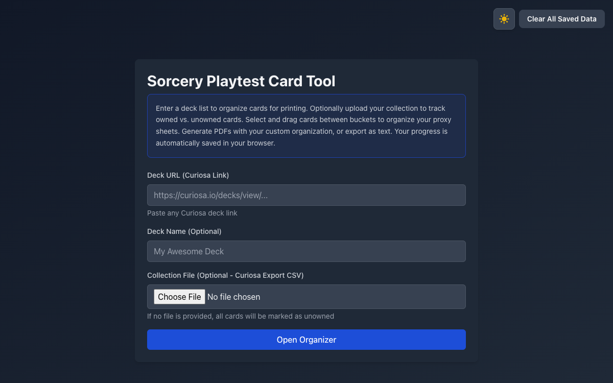

# Sorcery Deck Assembler

> **No longer actively developed.** Kept public as a portfolio piece; the Curiosa deck import may break if Curiosa changes its site.

A web app for organizing and printing playtest proxies for the trading card game *Sorcery: Contested Realm*.

- Import a deck list from a Curiosa deck link
- Track owned vs. unowned cards using a Curiosa collection export
- Drag cards into custom buckets to organize proxy sheets
- Generate print-ready PDF sheets and export deck lists as text
- Dark mode

The project was also an experiment in building an app almost entirely through AI-assisted coding ("vibe coding"): a Flask API with ReportLab/fpdf2 for PDF generation and a React + TypeScript + Tailwind front end, deployed on Vercel.

Card images are served by [card.cards.army](https://card.cards.army/), the image CDN for [spells.bar](https://spells.bar). `update_card_images.py` points every card in `card_data/master_cards.json` at its image there; re-run it after refreshing the card list with `data_setup.py`.

This is a fan-made project and is not affiliated with or endorsed by Erik's Curiosa. *Sorcery: Contested Realm* and its card names, text and art belong to their respective owners.



## Local Development

### Requirements

- Node.js 18+
- Python 3.9+

### Setup

```bash
# Install frontend dependencies
cd frontend
npm install

# Install backend dependencies (from root)
python -m venv venv
source venv/bin/activate  # On Windows: venv\Scripts\activate
pip install -r requirements.txt
```

### Running Locally

```bash
# Start both frontend and backend
./start.sh

# Or manually:
# Terminal 1 - Backend
source venv/bin/activate
python api/index.py

# Terminal 2 - Frontend
cd frontend
npm run dev
```

The app will be available at `http://localhost:5173`

## Project Structure

```
├── api/                    # Python Flask backend
│   └── index.py           # Main API endpoints
├── frontend/              # React + Vite frontend
│   ├── src/
│   │   ├── components/    # React components
│   │   ├── utils/         # API calls and utilities
│   │   └── types.ts       # TypeScript types
│   └── public/
├── card_data/             # Card database
│   └── master_cards.json  # Card information and image URLs
├── vercel.json            # Vercel deployment config
├── requirements.txt       # Python dependencies
└── package.json           # Build configuration
```

## Tech Stack

**Frontend:**
- React 18
- TypeScript
- Vite
- Tailwind CSS
- React Beautiful DnD

**Backend:**
- Python 3.9+
- Flask
- ReportLab (PDF generation)
- Requests

**Deployment:**
- Vercel (Frontend + Serverless Functions)
